# kona

**Bimodal terminal applets.** An applet is a view *you* browse **and** a set of
verbs an *agent* calls — over one shared state, in one process. You press
`space` to pause a timer; an agent calls `timer.start` with no window open; both
drive the same state and neither can tell the difference. That indifference is
the whole idea.

Think Commodore-64 immediacy — write a small thing, it's instantly usable — but
for an agentic era, and without MCP's ceremony.

## What it looks like

Every applet, shot at the same 80x24 window, straight from the hero fixture its
own test suite asserts on — `bun run shots` regenerates the set from whatever is
installed, and `bun test` fails when a UI change leaves them stale. Nothing here
is hand-placed: add an applet, re-run it, and its portrait slots in.

<!-- shots:start -->
<!-- generated by `bun run shots` from each applet's hero fixture — do not edit by hand -->
<table>
<tr>
<td width="50%" valign="top">
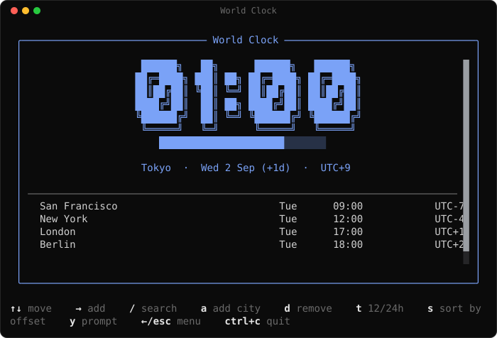
<br><sub><a href="applets/clock/README.md"><code>clock</code></a> — Every city you care about, at a glance. Add zones by hand or by agent.</sub>
</td>
<td width="50%" valign="top">
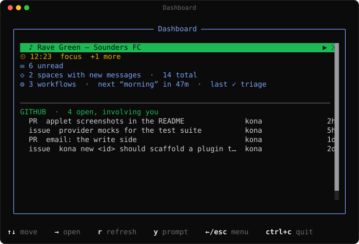
<br><sub><a href="applets/dash/README.md"><code>dash</code></a> — Live cockpit — whatever your applets say is happening right now.</sub>
</td>
</tr>
<tr>
<td width="50%" valign="top">
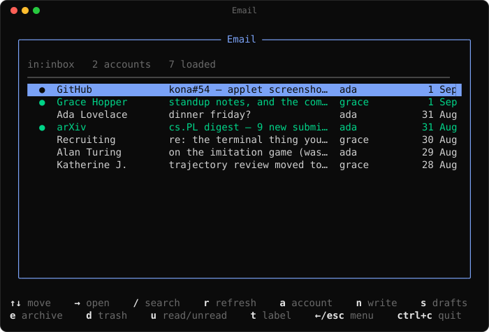
<br><sub><a href="applets/email/README.md"><code>email</code></a> — Read, write, reply and file mail from Gmail and Outlook in one list.</sub>
</td>
<td width="50%" valign="top">
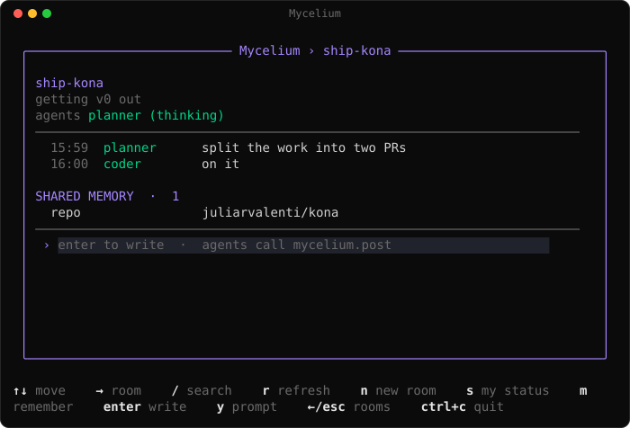
<br><sub><a href="applets/mycelium/README.md"><code>mycelium</code></a> — The coordination layer — rooms, agents, and what you say to them.</sub>
</td>
</tr>
<tr>
<td width="50%" valign="top">
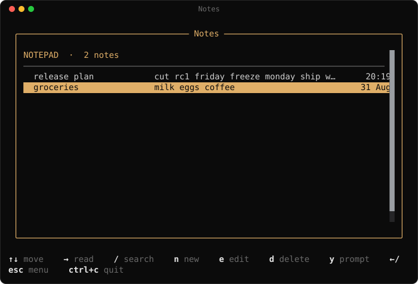
<br><sub><a href="applets/notes/README.md"><code>notes</code></a> — A notepad: titled, multi-line notes that survive restarts.</sub>
</td>
<td width="50%" valign="top">
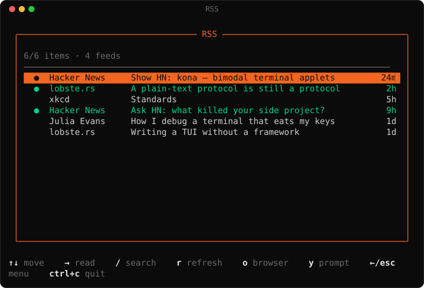
<br><sub><a href="applets/rss/README.md"><code>rss</code></a> — Your feeds as one river. Agents can search and open items too.</sub>
</td>
</tr>
<tr>
<td width="50%" valign="top">
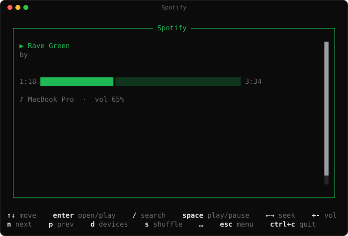
<br><sub><a href="applets/spotify/README.md"><code>spotify</code></a> — Now playing + transport control.</sub>
</td>
<td width="50%" valign="top">
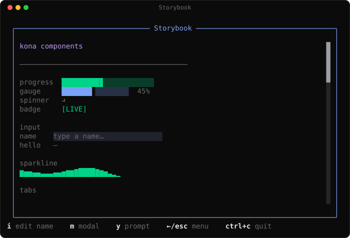
<br><sub><a href="applets/storybook/README.md"><code>storybook</code></a> — Live gallery of kona components.</sub>
</td>
</tr>
<tr>
<td width="50%" valign="top">
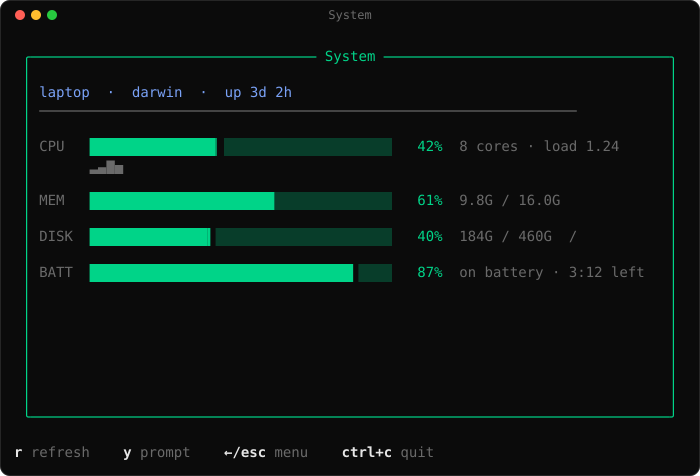
<br><sub><a href="applets/sys/README.md"><code>sys</code></a> — Live CPU, memory, disk, and battery gauges.</sub>
</td>
<td width="50%" valign="top">
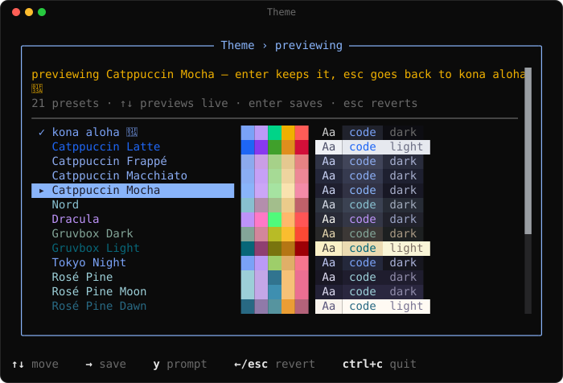
<br><sub><a href="applets/theme/README.md"><code>theme</code></a> — Catppuccin, Nord, Dracula and friends — previewed live, saved on enter.</sub>
</td>
</tr>
<tr>
<td width="50%" valign="top">
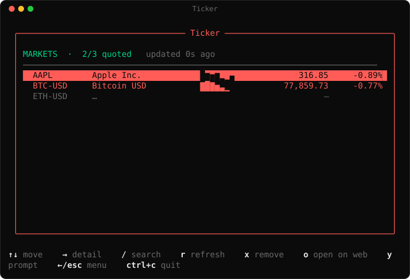
<br><sub><a href="applets/ticker/README.md"><code>ticker</code></a> — Watchlist board — stocks and crypto, price, %chg, sparkline.</sub>
</td>
<td width="50%" valign="top">
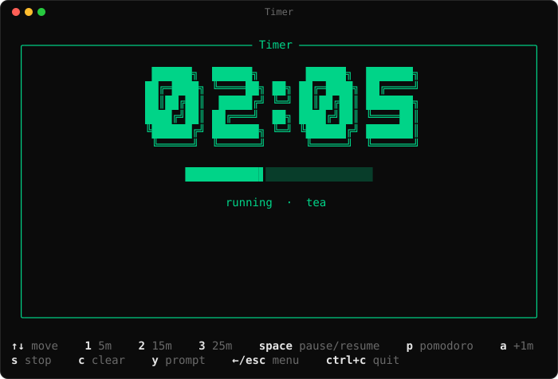
<br><sub><a href="applets/timer/README.md"><code>timer</code></a> — Countdowns and a pomodoro. Presets 1/2/3; space pauses; p pomodoro.</sub>
</td>
</tr>
<tr>
<td width="50%" valign="top">
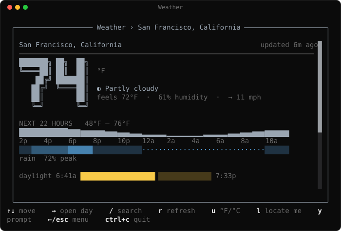
<br><sub><a href="applets/weather/README.md"><code>weather</code></a> — Current conditions and the week ahead, from open-meteo.</sub>
</td>
<td width="50%" valign="top">
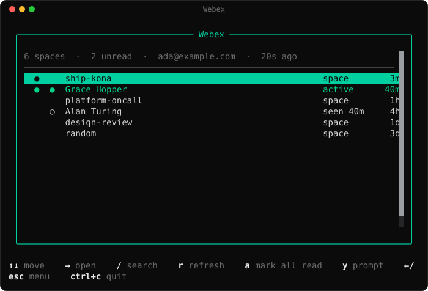
<br><sub><a href="applets/webex/README.md"><code>webex</code></a> — Spaces, their messages, and a verb that posts back.</sub>
</td>
</tr>
<tr>
<td width="50%" valign="top">
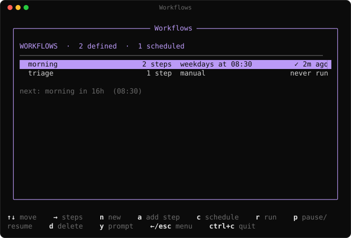
<br><sub><code>workflows</code> — Named sequences of applet verbs — run them by hand, or on a cron.</sub>
</td>
</tr>
</table>
<!-- shots:end -->

## Why not just MCP?

MCP makes a tool *either* agent-callable (headless, JSON) *or* a thing you look
at — never both. kona collapses that: an applet is a pure object

```ts
{ view, verbs, keymap }   // over shared state
```

and *who* fires a verb (your keypress vs. the agent's HTTP call) is irrelevant
to the applet. The daemon owns state; the TUI is just one client; an agent is
just another client.

## Shape

```
server/    konad — owns state (KV, persisted), runs the cron scheduler, streams SSE
host/      OpenTUI client — launcher (scrolls, filters) → applet view → keymap
sdk/       defineApplet({ view, verbs, keymap, tick }), the tool manifest,
           and sdk/testing.ts — the whole plugin ABI
core/      loader, config/theme, HTTP client, skill + catalog generators
applets/
  timer/     one applet, one package:
             index.ts        the applet — defineApplet(...)
             timer.test.ts   its unit tests
             snapshots.ts    its rendering fixtures (one is its portrait)
             README.md       its docs
docs/shots/  one SVG per applet, rendered from those portraits
```

Every applet is a self-contained package: kona discovers it, its tests, its
fixtures and its docs from that one directory. See
[CONTRIBUTING.md](CONTRIBUTING.md).

## Use

```sh
bun install

kona                       # your default applet, else the launcher
kona launcher              # always the launcher: pick an app
kona timer 5m              # open the timer, pre-started
kona timer pomodoro        # ...or a 25/5 work-break cycle
kona ls                    # list applets (plugins and linked files marked)
kona docs [applet]         # the applet catalog, or one applet's README
kona new <id>              # scaffold a new applet package
kona plugin install <url>  # ...or install a package someone else built
./applets/timer/index.ts   # an applet file with a shebang, run directly
kona link <file.ts>        # ...or keep one loadable by id without opening it
kona tools                 # the manifest an agent reads
kona tools --json          # ...with docs, example args, and the key each verb binds
kona tools --skill         # that manifest as a drop-in agent skill
kona workflows            # named sequences of verbs; enter opens one
kona call timer start '{"seconds":300}'   # ← exactly what an agent does
kona state timer           # read current state
kona config                # show the resolved config (init writes a starter)
kona accounts              # connected mailboxes (kona login gmail|outlook)
```

The daemon (`konad`) autostarts on first use; state lives in
`~/.local/state/kona/state.json`.

In the TUI, `↑`/`↓` (or `k`/`j`) move, `→`/`enter` opens, `←`/`esc` goes back,
`/` searches, and `y` copies an agent prompt for whatever is on screen (below).
The mouse works the same way: click a row to select and open it, scroll the
wheel to scroll.

The launcher is that same list, one level up: it scrolls to keep the cursor on
screen however many applets are installed, and typing (or `/`) filters by name,
id or summary — `enter` opens the match you land on, `esc` clears the filter.
Each row wears its applet's glyph and color, with its one-liner underneath.

### Desktop notifications

The daemon can post native macOS banners when something happens — a countdown
hits zero, a new PR involves you, unread mail lands — so an always-open dash is
actually ambient. Every event is opt-in and toggled from the CLI:

```sh
kona notify                    # what can fire, and what's on
kona notify on email.unread    # opt in
kona notify off timer.done     # opt out  (`all` for the master switch)
kona notify test               # prove it reaches your screen
```

Settings live in `~/.config/kona/notify.json`; the daemon picks up a change
within a second. `KONA_NOTIFY=0 kona daemon` runs a silent session. Banners go
through `terminal-notifier` when it's installed (clickable — a GitHub banner
opens the PR) and `osascript` otherwise; elsewhere than macOS it's a no-op.

Applets fire them from any verb or tick:

```ts
import { notify } from "../../server/notify.ts";
void notify({ event: "timer.done", title: "Timer", body: "05:00 is up." });
```

Repeats of the same `key` inside a window are dropped and a burst is rate
limited, so a re-sync can't spam you. An applet declares the events it can raise
in its own `notifications` block — that is what makes one listable and
toggleable, so a new applet adds a banner without editing `server/notify.ts`.

## Applets

Each applet documents itself, in its own package:

```sh
kona ls                  # what's installed here
kona docs                # the catalog, generated from the live manifest
kona docs email          # applets/email/README.md
```

There is deliberately no exhaustive list of applets in this file. A dozen-plus
ship in `applets/`, you may have more installed as plugins, and any bare list
here would be wrong the day someone adds one — which is the whole point of the
package boundary below. `kona ls` is always right. The notes that follow cover
the applets that need setup beyond `mkdir`.

`email` is provider-abstracted: `server/mail.ts` defines a `MailProvider`
(list an inbox, open a thread, send, save a draft, mark read, archive, trash,
label) that Gmail and Outlook both implement, and the applet only ever talks to
that seam. Connect as many mailboxes as you like — they merge into ONE inbox,
newest first, each row badged with the account it came from, and a reply leaves
from the mailbox it arrived in.

```sh
kona login gmail             # Google OAuth (read + send)
kona login outlook           # Microsoft Graph (read + send)
kona accounts                # what's connected
kona logout gmail ada@x.com  # drop one mailbox (omit the address for all)
```

Signed in with an older, read-only kona? Reading keeps working; the first
write says `reconnect for write access: kona login gmail` — run it once and the
new scopes are granted.

Each account's refresh token goes to the macOS Keychain (service `kona-gmail`
/ `kona-outlook`, account = the address); mail itself never touches disk. A
token stored by an older kona keeps working as-is.

In the TUI, `a` cycles the list between the unified inbox and one account at a
time. `n` opens the composer; in an open thread `enter` replies, `g` replies to
all and `f` forwards. `e` archives, `d` trashes, `u` toggles unread, `t` labels
and `s` shows your saved drafts. Opening a thread marks it read
(`[applets.email] autoRead = false` if you'd rather it didn't).

The composer is a modal of real text fields: tab moves between To / Cc /
Subject / Body, the body is written a line at a time, an **empty line sends**,
and `ctrl+s` parks it in the provider's Drafts folder to finish later.

Agents fire the same verbs — a form is only ever a way to fill in arguments:

```sh
kona call email accounts '{}'
kona call email account '{"id":"outlook"}'          # scope the list
kona call email search '{"q":"is:unread from:github"}'
kona call email open '{"account":"ada@x.com","id":"18f..."}'
kona call email reply '{"body":"on it — shipping tonight."}'
kona call email compose '{"to":"ada@x.com","subject":"dinner","body":"friday?"}'
kona call email draft '{"to":"ada@x.com","subject":"dinner","body":"half-written…"}'
kona call email archive '{"id":"18f..."}'           # or trash / label / markUnread
```

A verb called with everything it needs acts; called with nothing it opens the
form instead. `email.reply` with a `body` sends; without one it opens the
composer with the recipients filled in and the message quoted below.

Gmail's query syntax is the lingua franca: the Outlook provider translates
`from:`, `subject:`, `is:unread` and `has:attachment` into Graph's
`$search`/`$filter`.

**Google client.** Create a Desktop OAuth client, enable the Gmail API, and
save the JSON to `~/.config/kona/google.json` (or set
`KONA_GOOGLE_CLIENT_ID` / `KONA_GOOGLE_CLIENT_SECRET`). kona asks for
`gmail.modify` (read, unread flag, archive, trash, labels) plus
`gmail.compose`/`gmail.send`.

**Microsoft client.** Register an app in Azure → App registrations, add the
redirect URI `http://127.0.0.1:8897/callback` under *Mobile and desktop
applications*, grant the delegated Graph permissions `Mail.ReadWrite`,
`Mail.Send`, `offline_access` and `User.Read`, then save `{"client_id":"..."}` to
`~/.config/kona/microsoft.json` (or set `KONA_MICROSOFT_CLIENT_ID`;
`KONA_MICROSOFT_TENANT` pins a tenant, default `common`, and
`KONA_MICROSOFT_PORT` moves the loopback port). It's a public client — there
is no secret to keep.

For best HTML-email rendering, install a text renderer (same ones aerc/mutt
use); kona picks the first available, else falls back to a JS converter:

```sh
brew install w3m     # or: pandoc / lynx / elinks
```

### RSS

`rss` reads its feed list from `~/.config/kona/rss.toml` — a list of URLs, or
tables when you want to name a feed:

```toml
feeds = ["https://news.ycombinator.com/rss"]

[[feeds]]
name = "xkcd"
url  = "https://xkcd.com/atom.xml"
```

RSS 2.0 and Atom both work. Feeds are merged into one newest-first river,
refreshed every five minutes; `/` filters it, `o` opens the selected item in a
browser.

### Webex

`webex` is your spaces in the terminal: the list newest-first with an unread
dot, `→` to drill into one, and `c` to write back. Sign in either way — a
personal access token gets you looking around in a minute, an OAuth integration
keeps the daemon signed in:

```sh
kona login webex     # OAuth if ~/.config/kona/webex.json has a client, else
                     # it asks for a personal token (developer.webex.com)
```

```jsonc
// ~/.config/kona/webex.json — one or the other
{ "client_id": "...", "client_secret": "..." }   // OAuth integration
{ "token": "..." }                               // personal access token
```

An OAuth integration wants the redirect URI `http://127.0.0.1:8898/callback`
and the scopes `spark:rooms_read spark:messages_read spark:messages_write
spark:people_read`. Either credential ends up in the Keychain, never on disk;
`KONA_WEBEX_TOKEN` overrides both for a script.

Posting is the bimodal seam at its plainest — `post` is one verb with two
callers:

```sh
kona call webex post '{"space":"ship-kona","text":"deploy is green"}'
```

is exactly what pressing `c`, typing, and hitting enter does. `a` marks every
space read; agents call `webex.read '{"all":true}'`. Webex has no unread count
of its own, so kona keeps read receipts per space in
`~/.local/state/kona/webex-seen.json` — opening a space marks it read, and the
dash shows how many are still waiting. `[applets.webex]` takes `accent`,
`spaces` (how many to list, default 25) and `page` (messages per space,
default 30).

### Mycelium

The `mycelium` applet is a chat client for your coordination layer — rooms, the
agents in them, what they're saying, and the memory they share. You are *in* the
room, not watching it through glass: drill into a room, press `enter`, type, and
`enter` sends. It finds the data wherever it lives, in this order:

```sh
MYCELIUM_URL=http://127.0.0.1:8765   # the local daemon / OpenAPI backend
mycelium                             # the CLI, on PATH or ~/.local/bin/mycelium
~/.mycelium/rooms/                   # room files (dirs or JSONL logs)
```

```sh
kona mycelium                        # browse rooms, → to drill in, ← back
kona mycelium ship-kona              # ...or open straight into one
kona call mycelium post '{"room":"ship-kona","text":"picking up #38"}'
```

Every action is a verb, so you and an agent are peers in the same room firing
the same calls — `post` from the composer and `post` over HTTP are one code
path, and the room can't tell you apart except by the name on the message:

| key | verb | what it does |
| --- | --- | --- |
| `enter` | `compose` / `post` | write in the open room; enter sends |
| `n` | `create` | open a new room (`{"name":"Lit Review","topic":"papers"}`) |
| `s` | `status` | say what you're doing (`{"status":"shipping #38"}`) |
| `m` | `remember` | write shared memory (`{"key":"plan","value":"…"}`) |
| `r` | `refresh` | re-sync now (it also polls every 10s) |

`n`, `s` and `m` with no arguments open a small form — a real `input` field in a
floating dialog, `tab` between fields, `enter` commits. The form only fills in
the arguments; the verb it commits through is the one an agent calls directly.

Your message shows the moment you send it and is reconciled with the backend on
the next poll, so a slow room never feels slow. Posting needs a backend that can
take a write: the OpenAPI daemon, the CLI, or room files kona can append to. When
none can, the composer is replaced by a read-only notice saying what to connect —
never a text field that quietly eats what you type.

kona posts as `kona`; set another name with `[applets.mycelium] agent = "…"` in
`config.toml` or `MYCELIUM_AGENT`. Turn on `kona notify on mycelium.message` for
a banner when a room gets busy while you're elsewhere.

### Workflows

A **workflow** is a named, ordered sequence of verb calls — kona's answer to
Shortcuts, except the steps are applet verbs and both you and an agent can
define, run and schedule them:

```sh
kona call workflows define '{"name":"morning","cron":"30 8 * * 1-5","steps":[
  "email.refresh",
  "notes.add {\"text\":\"{{steps.0.unread}} unread\"}",
  "timer.start {\"seconds\":1500,\"label\":\"focus\"}"]}'

kona call workflows run '{"name":"morning"}'
kona workflows                      # the list: steps, schedule, last run
```

In the TUI, `n` names a new one, `a` adds a step (`applet.verb {json}` — the
same line an agent writes), `c` schedules it, `r` runs it, `p` pauses the
schedule and `enter` inside a workflow tests the step under the cursor. Every
one of those keys fills in the arguments of the verb an agent calls directly;
there is no keyboard-only path.

| key | verb | what it does |
| --- | --- | --- |
| `n` | `define` | name a new workflow |
| `a` | `addStep` | append a step |
| `c` | `schedule` | put it on the daemon's clock |
| `r` | `run` | run it now |
| `p` | `toggle` | pause/resume the schedule |
| `enter` | `runStep` | fire the selected step on its own |

**Steps talk to each other.** Any string in a step's args can reference the run:
`{{params.room}}` (what the caller passed), `{{steps.0.unread}}` or
`{{steps.<as>.…}}` (an earlier result), `{{last.id}}`, `{{now}}`. A reference on
its own keeps its type; one inside a sentence is interpolated. A step may also
carry `when` — `when={{steps.0.unread}}`, `when=steps.0.count > 0` — and is
skipped when it is false. A step that fails stops the run, and the failure is on
the workflow's history and the applet's frame.

**Scheduling is the daemon's.** `schedule` takes a 5-field cron expression, an
`@daily`-style shorthand, or `@every 10m`; the daemon fires the steps itself,
with no terminal open, exactly as an internal caller hitting the same verbs.
That generalizes kona's per-applet `tick` from a heartbeat to a calendar: an
applet can now declare `cron(state) -> CronJob[]` and the daemon schedules it
from live state (see `server/cron.ts`). The dash shows what runs next.

**Workflows are text, not a walled garden.** `export` renders one as a
SKILL.md-shaped document — YAML frontmatter plus literal `kona call` lines — and
`import` reads it back, including skills someone wrote by hand:

~~~md
---
name: morning
description: Start the day
schedule: 30 8 * * 1-5
---

## Steps

```sh
kona call email refresh  # as=inbox
kona call notes add '{"text":"{{steps.inbox.unread}} unread"}'
```
~~~

### Ticker

The `ticker` applet needs no account — quotes come from a keyless public
endpoint that covers stocks, ETFs, indices and crypto alike. Set the watchlist
once and it stays warm in the daemon:

```jsonc
// ~/.config/kona/ticker.json
{ "watchlist": ["AAPL", "NVDA", "SPY", "BTC-USD", "ETH-USD"] }
```

or `KONA_TICKER_SYMBOLS="AAPL,BTC-USD"`. In the applet, `/` adds a symbol and
`x` drops the selected one; an agent does the same with
`kona call ticker add '{"symbol":"NVDA"}'`.

## Agent skill

An agent drives kona through four calls — discover, read, call, watch — and
`AGENTS.md` is the short version. The long version ships as a **skill**, and it
is *generated*, not written:

```sh
kona tools --skill                   # print it
kona tools --skill --install         # write .claude/skills/kona/SKILL.md
kona tools --skill --out ~/.claude/skills/kona/SKILL.md
bun run skill                        # the same install, from the repo
```

The daemon renders it (`GET /skill`) from the applets it actually loaded, so the
skill can never describe a verb the machine doesn't have — drop in a new applet
and re-run it. The rendered file is a build artifact, not a source file: it is
gitignored and regenerated (a `SessionStart` hook does it for Claude Code), so
adding an applet never means committing a regenerated skill that collides with
somebody else's.

What feeds it is per-applet, next to the verbs themselves:

```ts
docs: {
  start: { doc: "Start a countdown. `seconds` takes 300, \"5m\" or \"1h30m\".",
           args: { seconds: 300, label: "tea" } },
  clear: "Drop the countdowns that already finished.",
},
recipes: [{ title: "Start a focus timer", steps: ["kona call timer start '{\"seconds\":1500}'"] }],
```

`docs` becomes the manifest's `doc`/`args` (so `GET /tools` alone is enough to
call a verb — an agent never hardcodes an applet id), and `recipes` become the
skill's worked examples. The manifest also carries the applet's title and the
key each verb binds in the TUI, which is the bimodal thesis in one line: the
same verb, whichever hand fires it.

### Copy prompt

The skill is the durable half — installed once, describing every applet. The
other half is *"teach my agent about the thing I am staring at, right now"*:
press **`y`** in any applet and its whole surface is on your clipboard, ready to
paste into an agent — the verbs, their example args, the key you'd press for
each, and both seams (`kona call …` and the HTTP route at the port this host is
talking to). In the launcher — where a bare letter is spent on type-to-filter —
the key is **`ctrl+y`**, and what you get is the whole installed set instead.

The same blurb from the command line:

```sh
kona prompt spotify            # print it
kona prompt spotify --copy     # ...straight to the clipboard
kona prompt                    # every applet installed here
kona prompt spotify --skill    # one applet as a drop-in SKILL.md stanza
```

It is rendered from the live manifest by the same code that renders the skill
(`core/prompt.ts` over `toolsForApplet`), so a copied prompt cannot describe a
verb this machine doesn't have, and cannot drift from what `kona tools --json`
says. The clipboard is `pbcopy` on macOS, `wl-copy`/`xclip`/`xsel` on Linux and
`clip` on Windows; `KONA_CLIPBOARD="ssh mac pbcopy"` overrides the command,
which is also how you copy out of an ssh session.

`y` is a platform key, not an applet's: the host handles it for every applet,
and `ctrl+y` for the launcher. An applet that binds `y` itself keeps it, and the
hint bar yields the `y prompt` legend rather than spending a second footer line
on it.

## Config

Everything tweakable lives in one optional file, `~/.config/kona/config.toml`.
With no file you get the defaults below — `kona config init` writes them out
commented, `kona config` prints what's actually in effect (and any complaints
about the file; a bad value is ignored, never fatal).

```toml
default = "dash"      # applet a bare `kona` opens; omit for the launcher

[theme]               # the palette — applets name ROLES, never hexes
preset = "nord"       # start from a named palette (`kona theme` lists them)
accent = "#7aa2f7"    # ...and any role you spell out wins over it
alt    = "#bb9af7"    # secondary tint
fg     = "#d0d0d0"    # body text
dim    = "#6a6a6a"    # labels, hints
muted  = "#5a5a5a"    # idle / inactive
ok     = "#00d488"    # running, unread, success
warn   = "#f0b000"    # paused, degraded
error  = "#ff5c57"    # failure
key    = "#e6e6e6"    # keybind glyphs
bg     = "#0b0b0b"    # text on an accent fill

plugins = ["~/src/my-applet"]   # load applets from outside this repo

[applets.spotify]     # per-applet blocks
accent = "#1db954"    # `accent` retints any applet's frame — and its launcher row
icon   = "♫"          # `icon` is its glyph in the launcher (one cell)
```

Concrete per-applet blocks are not listed by hand here — each applet ships its
own commented `configSample` and `kona config init` composes them. For example
the timer contributes `[applets.timer] default`/`[applets.timer.pomodoro]`,
email contributes `[applets.email] page`/`autoRead`, and mycelium contributes
`[applets.mycelium] agent`.

The per-applet blocks are contributed by the applets: each one ships a commented
`configSample`, `kona config init` composes them, and `kona docs <id>` explains
what they mean. `[applets.<id>] accent` and `icon` work for every applet.

Fifteen roles retheme all of kona because no applet hardcodes a color: they call
`theme().ok` and the stage paints from the same table.

```ts
import { text, theme } from "../../sdk/index.ts";

view: (s) => [text(s.done ? "done" : "working", { color: theme().ok })]
```

`appletConfig("<id>")` hands an applet its own `[applets.<id>]` block, and
`appletAccent`/`appletString`/`appletNumber` read one key with a fallback.

### Presets, and switching them without a restart

`core/themes.ts` ships the palettes people already know — Catppuccin (all four),
Nord, Dracula, Gruvbox, Tokyo Night, Rosé Pine, Solarized, Everforest, Kanagawa,
One Dark, Ayu — each mapped onto **every** role, so nothing renders muddy. kona's
own `kona-aloha` is the default.

```sh
kona theme                    # the picker: ↑↓ previews LIVE, enter saves, esc reverts
kona theme nord               # apply one from the shell
kona call theme list          # ...and the same thing from an agent
```

The picker is an ordinary applet (`applets/theme`), previewing through one
addition to the applet ABI: `theme(state)` returns a palette that stands in for
the configured one while that applet is open, so the frame, the hint bar and
every row recolor as the cursor moves — and leaving drops the preview with
nothing to undo. `enter` writes `[theme] preset` into your config, and the
running TUI (a separate process from the daemon that wrote it) picks the file up
on its next frame.

## Writing an applet

An applet is a **package**, and the rule is: adding one edits **no shared file**.

```sh
kona new pomodoro              # applets/pomodoro/ — applet, fixtures, test, docs
kona new pomodoro --plugin     # ...or ~/.config/kona/plugins/pomodoro, outside the repo
bun test applets/pomodoro
kona pomodoro
```

That directory is everything kona knows about it:

| file | who reads it |
| --- | --- |
| `index.ts` | the loader — `defineApplet(...)` as the default export |
| `snapshots.ts` | `tests/snapshot.test.ts`, which discovers fixtures per package — and `bun run shots`, which photographs the hero one for the gallery above |
| `<id>.test.ts` | `bun test`, which finds tests wherever they live |
| `<id>.live.test.ts` | you, on purpose — the opt-in run against the real provider |
| `README.md` | `kona docs <id>` and the generated catalog |

`bun test` never touches a real account: every provider call goes through one
transport (`server/transport.ts`) that refuses to leave the machine under test,
and an applet whose verbs fetch installs a fake instead — `fakeProviders()` from
`sdk/fake.ts`, answering from `tests/fixtures/`, recording the writes it would
have sent rather than sending them.

The definition is also the manifest: `docs`/`recipes` feed the agent skill,
`notifications` register the applet's desktop banners, `auth` adds a
`kona login <service>`, `cli` gives it arguments (`kona timer 5m`),
`configSample` contributes to `kona config init`, and `dash` is the line the
applet puts on the [dashboard](applets/dash/README.md) when something of its own
is live. Nothing central to append to, so two people adding two applets never
conflict.

Applets load from `applets/*/` in this repo, from `~/.config/kona/plugins/*/`,
and from anything named by `plugins` in config.toml or `KONA_PLUGINS`. The
stable surface a plugin targets — `defineApplet`, the view vocabulary,
`sdk/components.ts`, `sdk/markdown.ts`, `AppletCtx`, `sdk/testing.ts` — is written
down in [CONTRIBUTING.md](CONTRIBUTING.md).

### Installing someone else's applet

An applet nobody here can see is still an applet: a package in a private repo
loads exactly like a built-in once it is on the machine. `kona plugin install`
is that "once" — the step before discovery, so it is a command rather than a
hand-rolled `git clone`.

```sh
kona plugin install git@github.com:me/kona-tome.git   # clone into the plugin dir
kona plugin install ~/src/kona-tome                   # ...or copy a local package
kona plugin install ~/src/kona-tome --link            # ...or point at the checkout
kona plugin install <src> --as tome                   # name the directory yourself
kona plugin list                                      # what is installed, and from where
kona plugin remove tome                               # delete it (a link, never its target)
```

It lands in `~/.config/kona/plugins/<name>/`, which the loader already scans, so
there is nothing to register and no config to edit: the applet is in `kona ls`,
the launcher, `kona docs` and the agent manifest from that moment on. A package
with its own `package.json` gets `bun install` run inside it; one that turns out
not to contain an `index.ts` is undone rather than left half-installed; and
`--link` symlinks a checkout you are still editing, so the plugin dir and your
working copy stay the same files.

The directory is the unit, not the applet: a package holding several applets
installs and removes as one plugin, and the applet ids stay whatever the
applets declare. `plugins = [...]` roots in config.toml are yours to manage —
they are loaded, never installed here, and `kona plugin remove` will not touch
them.

### An applet as an executable

`kona` takes a path as well as an id, so an applet file can be a command:

```sh
kona new pomodoro --plugin --executable   # writes `#!/usr/bin/env kona`, chmod +x
~/.config/kona/plugins/pomodoro/index.ts  # ...and the file runs itself
```

Running a module remembers it (`~/.config/kona/links.json`) and hands it to the
running daemon, so it is a first-class applet from that moment on — `kona call
pomodoro bump`, the launcher, `kona docs`, the agent manifest — with no restart
and no directory to install it into. `kona link <file>` is the same step without
the TUI, `kona unlink <id|file>` forgets it, and an id that is already installed
is refused rather than shadowed.

The file is an entry point, not a boundary: a linked module is imported into
konad like any other applet. Whether it should get its own *process* is measured
out in [docs/applet-processes.md](docs/applet-processes.md).

### Typing into an applet

`input(id, value, opts)` is a real editable text field you put in the view tree.
State owns both the text and the focus, so it stays bimodal:

```ts
input("name", state.name, { focus: state.editing, submit: "save", cancel: "cancel" })
```

While the field has focus the host takes every key (arrows move the caret,
readline bindings work, `enter` submits, `esc` cancels) and fires `save` with
`{ id, value }`. An agent skips the keyboard and calls the same verb:

```sh
kona call storybook save '{"value":"ada"}'
```

Pass `change` instead of waiting for `enter` to get a verb per keystroke; see
the `input` section of the storybook applet for a live one.

`textarea(id, value, opts)` is the same field with room for paragraphs — a note
body, a message you are writing. `enter` inserts a newline there, so **`ctrl+d`**
is what submits; long lines word-wrap inside the field, `↑`/`↓` walk the lines,
and the block scrolls under the caret. `rows` sets its height (6 by default):

```ts
textarea("note.body", state.draft.body, { rows: 8, width: 50, submit: "save", change: "field" })
```

The value keeps its newlines all the way through — into state, into the verb's
`{ id, value }`, and back out to an agent reading `kona state notes`. See the
composer in `applets/notes/index.ts`.

A field works inside an `overlay` too, which is what makes a dialog a *form*:
while one is up the host routes keys to the field (enter submits, esc cancels,
`←`/`→` move the caret) and any other key the editor doesn't want falls through
to the overlay's own keymap — bind `tab` there to move between fields. See the
new-room dialog in `applets/mycelium/index.ts`. `submitLabel`/`cancelLabel` name
what enter and esc do in the hint bar ("enter send" beats "enter save").

### Composing and scheduling

Two optional fields let an applet reach past its own state. `ctx.call(applet,
verb, args)` fires another applet's verb through the same entry point HTTP uses
— that is how one workflow step runs — and `cron(state)` hands the daemon verb
calls to make on a calendar:

```ts
cron: (s) => s.jobs.map((j) => ({ id: j.id, cron: "30 8 * * 1-5", verb: "run", args: { id: j.id } })),
```

The daemon re-reads `cron(state)` on every scheduler pass, so a job appears,
changes or disappears the moment a verb edits state — no registration step. Use
`tick`/`tickMs` for a heartbeat ("every N ms while loaded") and `cron` for a
calendar ("08:30 on weekdays"); expressions take the 5 standard fields,
`@daily`-style shorthands, or `@every 10m`.

## Status

v0 walking skeleton. The daemon, SDK, agent seam, cron scheduler, and
shared-state loop are verified. The OpenTUI host is written against the pinned API and runs
in a real terminal (it needs a TTY; it won't render under a pipe).
